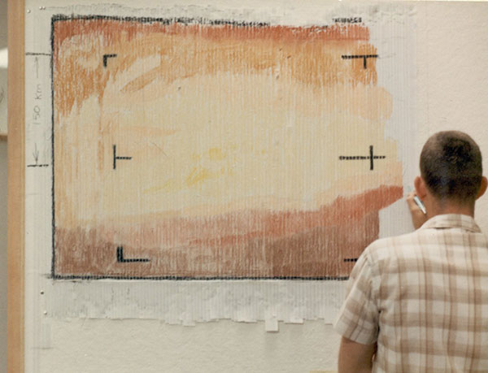

>*Any sufficiently advanced technology is indistinguishable from magic.*
>--Arthur C. Clarke[^1]

Powerful undead wizards within the lore of Dungeons and Dragons are known as a lich. They are creatures who have overcome the limits of their own mortality through magical and technological means. The process of turning oneself into a lich requires the creation of a powerful artifact known as a phylactery[^2], in which the soon to be Lich stores their distilled essence. This process often takes the majority of their natural life to achieve, as both the knowledge and financial cost to construct such a device is extensive[^3]. Upon the creation of this vessel, the lich enters a state of immortal undeath - free to pursue their research and inevitably lose whatever humanity they once had. 

What the lore here is describing is in a sense a form of ultimate archive, even a form of digitization. Through sets of coded instructions, would it be possible to transcend into a form of digital undeath? The source code of any algorithm could be considered at its core a form of magic, a set of instructions for digital incantation. The very nature of coding languages include hints to this magic, from hexspeak to “heavy wizardry”[^4]. I would argue that an artist’s practice is not so dissimilar from a complex algorithm. I offer this text as a primer for my practice. As a means of creating my own algorithm or phylactery, with the hopes that others might follow. How this might be accomplished is subjective to each individual, as are the reasons for doing so. However as any true wizard or research creator might attest, time is fleeting, and data is precarious. Only by archiving, summarizing and sharing might the research continue. 

---
**ARTIFICIAL AESTHETICS**

Let us first consider aesthetics. Computers are simple processing machines, they offer minimal creativity on their own. Even the most up to date stable diffusion AI must be trained[^5]. While at first they feel creative, the images they create are predictable. We depend on predictable results for automated outputs. In 1957, Russell Kirsch developed a method of digitizing an image, first by digitizing a photograph of his infant son Walden. The result, in contrast to the source image, is mired with pixel artifacting and noise associated with the mechanical process. Transferring the analog world to the strict rule set of a binary one results in an artificial aesthetic. When digitizing images we are limited by the fidelity of technology at the time. Compression and translation are constantly improving, however they still are subject to 0’s and 1’s. Aesthetic choices of the digital world are not voluntary. Pixels are static hard edge blocks which only at a greater distance appear smooth. These are often the first things we notice about a “poor image”[^6], either due to generation loss[^7] or image compression. There are some ways around this, or even ways to incorporate human creativity into this process. In 1965, a camera system designed by NASA/JPL, thanks in part to Kirsch’s early experiments, flew to Mars to capture the first ever digital image of another planet. After receiving the first snippets of data, the team at JPL used a pastel set from a nearby art supply store to hand-color a numerical printout of the raw pixel values.

*A member of the JPL team hand-rendering the first image of Mars with a pastel crayon.*

[^1]: Please use these footnotes as a bit of a recurring chat window. Or a resource for terms to search for. 
[^2]: Urns, rings, wands, dolls, any object or even a family line could be used as a phylactery. 
[^3]: Wizards of the Coast, Inc, editor. Monster Manual. 5th edition, Wizards Of The Coast, 2014. -- states this ritual has a material cost of 120,000 gold pieces. Worth approximately $37,320,000 today. 
[^4]: Referring to code based on obscure or undocumented intricacies of a particular hardware or software.
[^5]: Image based AI models are fed hundreds or thousands of pre-existing images in order to generate an output.
[^6]; https://www.e-flux.com/journal/10/61362/in-defense-of-the-poor-image/
[^7]: Copying of a copy over hundreds of generations
