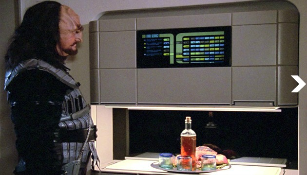

# SOURCERY

>*Any sufficiently advanced technology is indistinguishable from magic.*
>--Arthur C. Clarke[^1]

Powerful undead wizards within the lore of Dungeons and Dragons are known as a lich. They are creatures who have overcome the limits of their own mortality through magical and technological means. The process of turning oneself into a lich requires the creation of a powerful artifact known as a phylactery[^2], in which the soon to be Lich stores their distilled essence. This process often takes the majority of their natural life to achieve, as both the knowledge and financial cost to construct such a device is extensive[^3]. Upon the creation of this vessel, the lich enters a state of immortal undeath - free to pursue their research and inevitably lose whatever humanity they once had. 

What the lore here is describing is in a sense a form of ultimate archive, even a form of digitization. Through sets of coded instructions, would it be possible to transcend into a form of digital undeath? The source code of any algorithm could be considered at its core a form of magic, a set of instructions for digital incantation. The very nature of coding languages include hints to this magic, from hexspeak to “heavy wizardry”[^4]. I would argue that an artist’s practice is not so dissimilar from a complex algorithm. I offer this text as a primer for my practice. As a means of creating my own algorithm or phylactery, with the hopes that others might follow. How this might be accomplished is subjective to each individual, as are the reasons for doing so. However as any true wizard or research creator might attest, time is fleeting, and data is precarious. Only by archiving, summarizing and sharing might the research continue. 

---
**ARTIFICIAL AESTHETICS**

Let us first consider aesthetics. Computers are simple processing machines, they offer minimal creativity on their own. Even the most up to date stable diffusion AI must be trained[^5]. While at first they feel creative, the images they create are predictable. We depend on predictable results for automated outputs. In 1957, Russell Kirsch developed a method of digitizing an image, first by digitizing a photograph of his infant son Walden. The result, in contrast to the source image, is mired with pixel artifacting and noise associated with the mechanical process. Transferring the analog world to the strict rule set of a binary one results in an artificial aesthetic. When digitizing images we are limited by the fidelity of technology at the time. Compression and translation are constantly improving, however they still are subject to 0’s and 1’s. Aesthetic choices of the digital world are not voluntary. Pixels are static hard edge blocks which only at a greater distance appear smooth. These are often the first things we notice about a “poor image”[^6], either due to generation loss[^7] or image compression. There are some ways around this, or even ways to incorporate human creativity into this process. In 1965, a camera system designed by NASA/JPL, thanks in part to Kirsch’s early experiments, flew to Mars to capture the first ever digital image of another planet. After receiving the first snippets of data, the team at JPL used a pastel set from a nearby art supply store to hand-color a numerical printout of the raw pixel values.

>*A member of the JPL team hand-rendering the first image of Mars with a pastel crayon.*

At the time this was much faster than waiting for the image data to be computer processed. The results were a melding of human and machine, with little relation to its photographic counterpart. In Kirsch’s digitized image, Artificial Aesthetics are far more recognizable. Data itself is the purest form of this aesthetic. We are offered a window into the inner workings of a digital image by visualizing this data. By intervening in the process of these images, such as the Mars image, we can creatively shape their predictable outputs. We’re able to control the intent of the image, deciding how artificial it can be. Datamoshing for example, is a type of intentional manipulation of digital video. More associated with a Glitch Art aesthetic, it takes advantage of image compression artifacting to create its visual style. 

>*Signal Loss [forest], 2017 - Shot during my time at Arteles in 2016, simulating memory degradation or signal loss using i-frame manipulation. https://vimeo.com/201506064*

By mixing two or more video sources and by manipulating their i-frames[^8], a single video can appear to meld through a form of digital snow[^9] to reveal the other. Glitch aesthetic is based on nothing more than a surprising outcome from a reliable process. In this case datamoshing is attempting to simulate an unintended effect of digital video. Making these aesthetics intentionally more apparent.

Contemporary painting has always seemed to focus on accuracy over intent[^10]. However the human eye and reality itself is subjective. Historically, painting has offered a unique means of representing reality[^11]. With intent not always superseding accuracy. The Hockney-Falco thesis argues Renaissance paintings from the 1500’s onwards were made with the extensive use of lenses as a way of achieving the most accurate images possible. Mostly these are perfect replications of reality[^12]. So perfect in fact that in a few examples clear evidence of photographic imperfections are present. Most notably in the 1523 Lorenzo Lotto painting, “Family Portrait''. We see part of a tablecloth dip in and out of focus. Something the human eye simply cannot do as it focuses on a subject.

![Family Portrait [detail], Lorenzo Lotto, 1523](images/LorenzoLotto-Family_Portrait_[detail].JPG)
>*Family Portrait [detail], Lorenzo Lotto, 1523*

Living in 1523, with the photograph still 300 years away I wonder if I would have the same reaction to this painting that I have towards computer generated imagery? Similarly, the painting “Old Woman'' by Georges de la Tour in 1619 seems skewed in some way. As if a projection the artist was possibly working from was hitting the surface of the canvas at a slight angle. The woman's legs in the painting seem stretched, as if their legs were disproportionally longer than their body. This type of optical distortion is so minor that a modern day viewer[^13] might not pay it any mind, yet something about these images appears unsettling. What effect does artificial aesthetics have on the viewer? Perhaps the greatest example is “the uncanny valley”. The aesthetic concept that relates to the emotional reaction or even revulsion against a human observer’s affinity for a replica. Specifically, the more such a replica begins to approach “real”, almost right up until it might become “correct”. Good design attempts to mitigate this effect with the use of skeuomorphs[^14], often used to make something new feel familiar. Usually though, we find these attempts at reality disturbing. The quest for perfected simulated reality continues. 

In 2015, the first entries into machine learning began making startling progress. The actual training of a program to direct and manipulate certain datasets. Able to entirely generate new and accurate images. Recently stable diffusion, generative adversarial networks (GAN), and source code offered by OpenAI has made it incredibly easy for the average user to train and generate their own images. For instance, The Image Generator[^15] project by Greg Surma attempts to generate new Simpsons characters by crawling through every frame of the show[^15] and outputs its interpreted results. Casey Reas[^16], uses a similar concept in his recent work. Using every frame of a film, Reas is able to generate additional (albeit horrifying) frames of these films. Also, with the growing availability of “DeepFake'' technology, artists are able to take

this process and apply it to the reskinning of human subjects. Thanks in part to older films or the wealth of images available on the internet, frames of an actor's face or well documented historical figure are compiled into a slowly rotating scan of their features[^17]. Autoencoders or GANs are then able to match these frames to a structure - an original video file. The result is a video of an original subject replaced with someone else’s likeness. These are early days for this type of technology, yet the concepts are there. Due to the limitations of processing power, the results are often easy to spot. Plunging face-first into the uncanny valley. However as graphics cards and rendering nodes are becoming cheaper and processing power itself is becoming more accessible, this technology is becoming far harder to detect. Almost to the point of invisibility in some cases. This could lead to a very confusing foreseeable future without proper media awareness. 

Stable diffusion models have produced a wave of AI generated art. Interestingly in most cases these have been centered on “creativity” rather than reality or accuracy. As a means to quickly populate these models with content to train from, online art communities such as DeviantArt and Behance were crawled and uploaded. The results of these AI generators are still predictable. Images that look and feel creative, but are no more than plagiarized illustrations of others' artists work. Perhaps as a reaction towards recent backlash from artists and the illustration community, newer stable diffusion models have begun to pop up. These are trained using stock photos, historical photographs, or even some capable of using a user submitted image as a starting reference.

![Fake misplaced test footage of the 80s “MATRIX“ Version by Alejandro Jodorowsky. Tommy Lee Jones as Agent Smith. Made by Infinite Odyssey Magazine using stable diffusion [Midjourney].](images/infiniteodyssey.mag_matrix_AI.JPG)
>*Fake misplaced test footage of the 80s “MATRIX“ Version by Alejandro Jodorowsky. Tommy Lee Jones as Agent Smith. Made by Infinite Odyssey Magazine using stable diffusion [Midjourney].*

The results are plagued with unconvincing structures, amorphous figures or landscapes that abruptly end, while a slick glossiness is ever present. If one were not aware of the process or original intent, they might consider these outputs a bizarre form of abstract realism. In time, these imperfections will be eliminated. For now, as its own form of skeuomorph, creators attempt to inject passable realism through the use of Photoshop. Splicing source photographs with generated ones. This intentional human interaction dilutes its artificial nature. 

---
**TRANSMUTATIONAL PROCESS**

Currently, contemporary painting seems to favor intent over accuracy. Possibly as a reaction against the slickness and proliferation of digital images, artists are embracing de-skilling as a means to create authentic images. Katherine Bernhardt’s recent series[^18] of hasty airbrushed Bart Simpson paintings literally moon a viewer expecting traditionally skillful paint handling. If authenticity is the goal here, does it need to retain a handmade or human quality for it to qualify? Could the predictable results of a pen plotter or laser cutter ever be de-skilled to a degree to appear human? Or if the artist were responsible for creating some of these fabrication technologies, how might their mark or hand translate over?

Taking this idea a step further, could an artist’s process be distilled into an algorithm? What goes into forming a digital phylactery? The Russian cosmists of the early 20th century theorized and advocated for radical life extension or even resurrection through the means of new scientific and technological advancements. Essentially the democratization of immortality[^19]. Today, this is more commonly associated with transhumanist thinking. Following in the footsteps of the Cosmists, billionaire Dmitry Itskov founded the 2045 initiative, an organization dedicated to the preservation of consciousness by uploading one's memories to some kind of machine[^20]. How close are we to this goal? We are now able to archive and sequence the entire human genome, even to the point of doing it through an at-home kit[^21]. Our behavior patterns online are tracked and monetized. Amazon can now accurately predict when exactly you’ll make that next purchase in order to advertise accordingly. Instagram constantly adjusts its explore page to the posts you’ve liked that day. Our YouTube search results can so distinctly contextualize who we are as individuals that our results differ from others who search for the same thing. It’s clear that the technology we use on a daily or even occasional basis intends to identify us. This idea of archiving an individual isn’t far-fetched as it once might’ve been. My systematic approach to painting takes this a step further, archiving my process. Doing so allows methods within my work to be highly reproducible, accomplishing a continuity between works. The incredibly precise patterns and hard edges are otherwise not possible without this technological collaboration. This isn’t to say that my or any artist’s process should be fully automated. As artists, by collaborating with technology we might better contextualize our expanding and ever obscuring digital world.

Image codecs and algorithms could be considered a form of digital spellcraft. In Scandinavian folklore a Svarteboken was a black book or grimoire containing a collection of rituals, incantations and spells. These would often only be readable by the author, or compiler of the spells[^22]. At their core these are a magical formula intended to affect change in the world. Either in a person or objects. Algorithms are a new form of magic. Coded spells that affect significant change in the real world[^23]. We allude to this magic when discussing technology. Like a Cyprianus[^24] programmers will often create lines of “heavy wizardry” within lines of code[^25]. A deliberately confusing or complex way of programming, often with little or no documentation. In some cases this is a form of job security. With a replacement not being able to fully understand the intent of the original code. Secrets are hidden, unreadable to those who do not possess the knowledge of their coded language. Even if written clearly, most source code is unreadable to most people. We place a blind faith in black box devices and systems that we rely on to magically “just work”. Relying on our pocket-sized spellbooks to hold long forgotten telephone numbers.[^26] This is precarious as we lose the ability to perceive how the programs and codecs we use on a daily basis function. In *New Dark Age*[^27] James Bridle discusses the implications of handing over aesthetic decision making to machine learning systems in order to design advanced radio antennas. The major caveat being, our inability to predict or even understand the resulting outputs. These systems tend to produce results that are almost impossible to trace a cohesive path backwards through. This highlights a growing problem as it applies to machine learning going forward: If artificial aesthetics become increasingly unrecognizable to human perception, should we be encoding an explanation within their process? Or is it up to artists and philosophers to try and contextualize them.

I look to image codecs as a source of comparison in my own work. Codecs[^28] are a system designed to encode or decode a digital signal or other forms of data using a specific formula or ruleset. The most commonly recognized of these forms are file extensions. .jpeg for example is probably the most widely used image compression algorithm in the world. Capable of reducing the size of a digital image considerably while still being human readable.[^29] This is the basis of all codecs, translating one form of information to another. With the earlier Mars image as an example, the NASA/JPL team fulfilled this role of the computer codec manually. Aesthetics didn’t matter here, they simply wanted to see if the data they had acquired correspond to anything. Their results are not an identical copy of the resulting photograph, there is a very real handmade quality to the image. In a sense my work attempts to correct the hollowness of digital images by developing a similar relationship with them. Through the process of teaching myself to code, building my own plotting machines and by painstakingly transferring countless sheets of vinyl, a bond is formed between myself, material, and the image. I acknowledge my own human limitations throughout the process, layers or paint applications aren’t perfect. Applications may vary. Ideally the resulting paintings allow this bond to form between the viewer and the process as well. These aren't perfect copies of digital files, but rather authentic analog images run through a personal codec.[^30]

>*A Klingon visitor using the Enterprise-D’s food replicator in 2368.*

As machine learning and artificial intelligence become more sophisticated we might be able to more accurately simulate the decisions of the human mind. One thing is then clear- the role of human creativity is essential. It’s not inconceivable to think that automation might fully replace humans as the main forms of cultural production. A future in which food is delivered via star trek-like replicators, or media is written by ChatGPT.[^31] We might begin to see a rise in “humanists” or human-made-tarians: This is to say, individuals that only purchase or consume items created by other humans. In this eventuality, artisans will have a greater role in society, and humanity as a whole may either pursue creativity and self-improvement.[^32] As this new taste for authenticity grows, a majority of us might become expert curators of our own taste.

# READ MORE:

* [SVG_VectorBend](https://github.com/badalmer/SVG_VectorBend)
  
* [GenNoise_HEX](https://github.com/badalmer/GenNoise_HEX)

* [Image-2-Text](https://github.com/badalmer/Image-2-Text)

[^1]: Please use these footnotes as a bit of a recurring chat window. Or a resource for terms to search for. 
[^2]: Urns, rings, wands, dolls, any object or even a family line could be used as a phylactery. 
[^3]: Wizards of the Coast, Inc, editor. Monster Manual. 5th edition, Wizards Of The Coast, 2014. -- states this ritual has a material cost of 120,000 gold pieces. Worth approximately $37,320,000 today. 
[^4]: Referring to code based on obscure or undocumented intricacies of a particular hardware or software.
[^5]: Image based AI models are fed hundreds or thousands of pre-existing images in order to generate an output.
[^6]; https://www.e-flux.com/journal/10/61362/in-defense-of-the-poor-image/
[^7]: Copying of a copy over hundreds of generations
[^8]: Intermediate Frames
[^9]: TV snow/noise indicating no signal
[^10]: Historically anyway.
[^11]: Van Eyck, Jan. The Arnolfini Wedding. 1434.
[^12]: Familiar with photography and its properties.
[^13]: Derivative objects that retain ornamental design from structures that were necessary in the original.
[^14]: https://towardsdatascience.com/image-generator-drawing-cartoons-with-generative-adversarial-networks-45e814ca9b6b
[^15]: https://frinkiac.com/
[^16]: One of the creators of Processing - a visual coding language directed towards designers and artists.
[^17]: Ctrl Shift Face - https://www.youtube.com/watch?v=4whz6UdXxhc
[^18]: "I'm Bart Simpson, who the hell are you?", Katherine Bernhardt, Canada Gallery, NY, January 11 - February 25, 2023.
[^19]: Access to resurrection for all!
[^20]: At the time of writing, this is still impossible.
[^21]: https://www.23andme.com
[^22]: Wizards, Witches, Warlocks. Sorcerers have inherent magic and need not write anything down.
[^23]: From shopping to our political views. All in the name of convenience.
[^24]: Usually the name given to the authors of a Svarteboken. A Wizard.
[^25]: // you are not expected to understand this.
[^26]: Anyone whose battery has died understands the fear of spellbook separation.
[^27]: Bridle, James. New Dark Age: Technology, Knowledge and the End of the Future. Verso, 2018.
[^28]: Short for coder-decoder.
[^29]: Although information solely for computer input is equally as common.
[^30]: A new type of codec, a human-codec? Keyed to personal taste and experiences.
[^31]: Parts of this text might’ve even been written by it!
[^32]: Bastani, Aaron. Fully Automated Luxury Communism: A Manifesto. Verso, 2019.
